# jupyter

## 

## 启动jupyter

1. 在自己指定的文件夹上面输入cmd

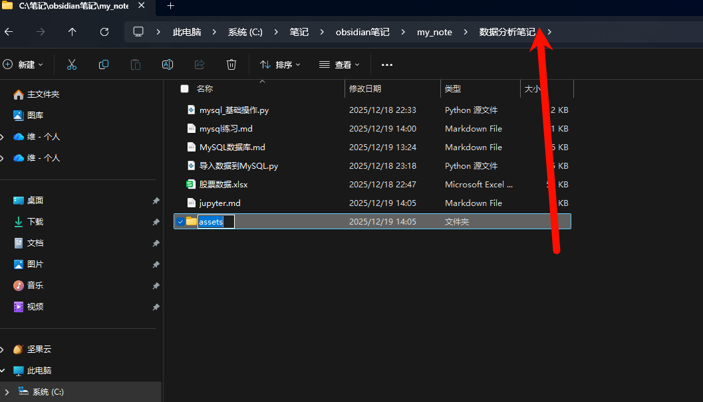

2. 在cmd里面输入`jupyter notebook`

3. 在浏览器打开链接，也可以用`ctr+点击`的方式打开链接
   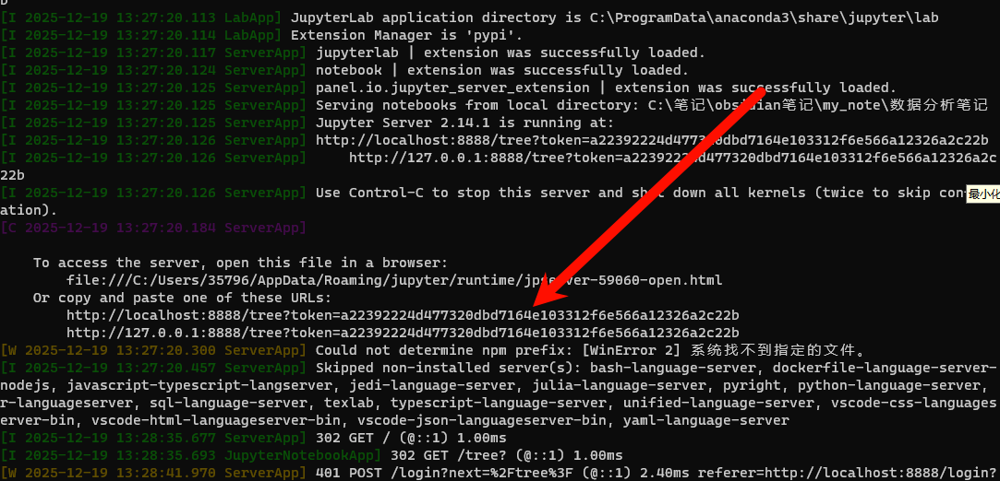

4. 点击`notebook`就能启动了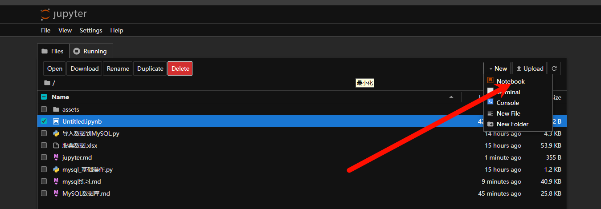

5. 测试一下，他这个类似于单元测试的格式，写一个测试一下。快捷键，`ctr+enter`就能一键执行。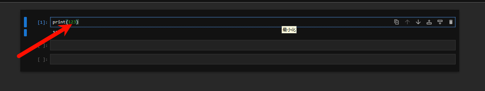

不要关掉cmd窗口，不然就运行不了了。关掉之前记得保存。

## 基础操作

### 俩种模式

code和markdown：

code就是可以运行的代码

markdown就是我们平常写的markdown

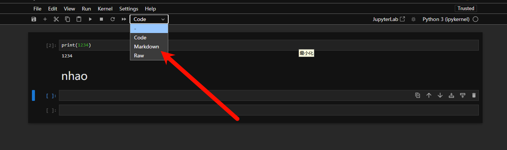

### 常用快捷键

A：向上加一行单元格

B：向下加一行单元格
DD：连续按俩下d，就是删除当前单元格

⬆️，⬇️：上下选择单元格

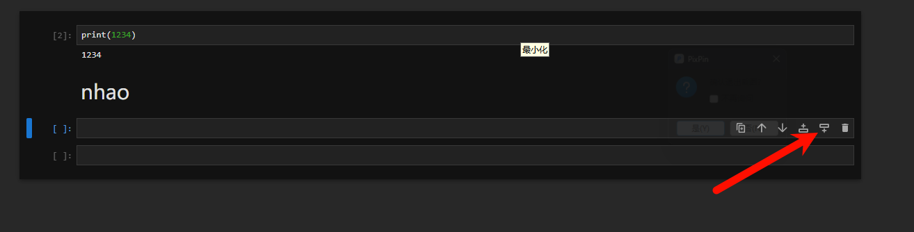：

### 运行方式

1. Ctr +Enter运行选中单元格，然后继续选中当前单元格

2. Shift +Enter 运行选中单元格，并且在其下方选中(新增)一个单元格

3. Alt + Enter 运行选中单元格，并且在其下方新增一个单元格

### 查看函数功能

1. help(要查询的对象)

2. 要查询的对象?

3. 光标在函数里面的时候按：Shift+tab

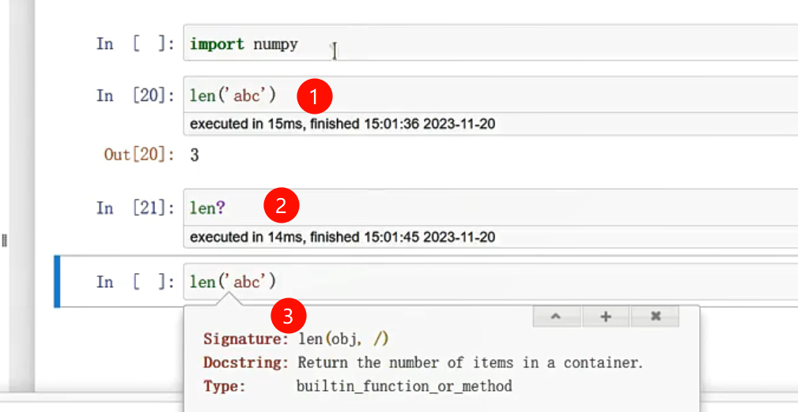

### 魔法指令

加载自定义的py文件（或者公司里面固定的一些脚本）。

`%run tools.py`加载完这个py文件之后，后面就可以用这个朋友文件里面的一些函数和变量了。

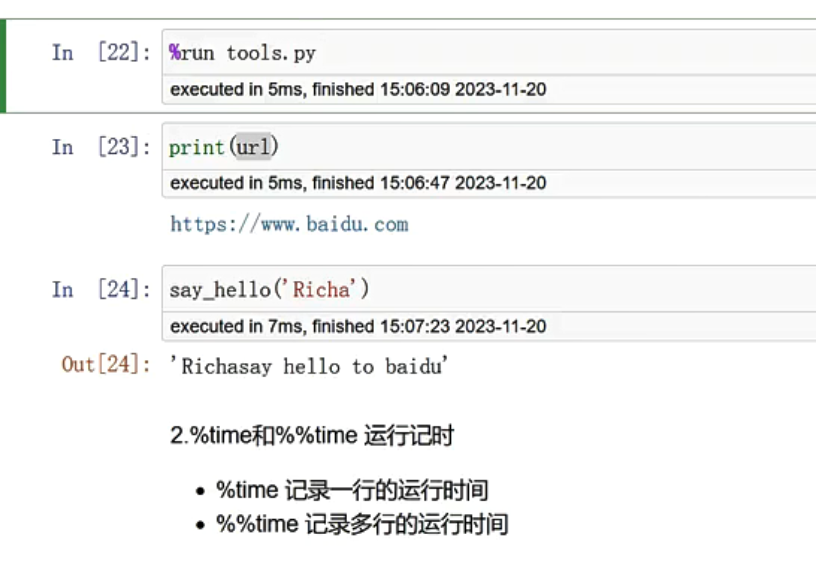

记录时间

1. %time 记录一行的运行时间

2. %%time 记录多行的运行时间

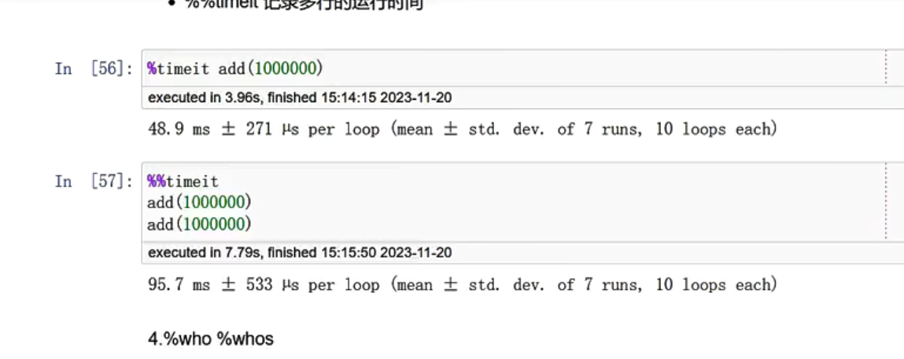

展示所有的函数和变量

%who

%whos

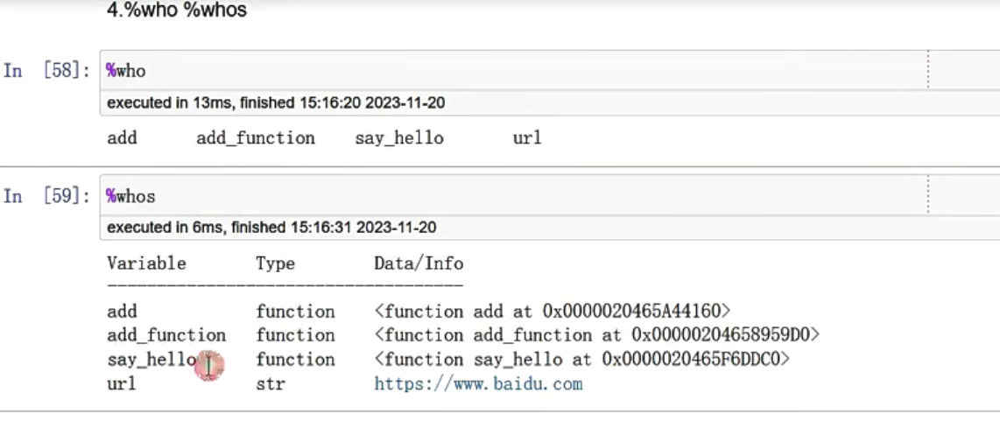

## 插件

到主页先点击这个

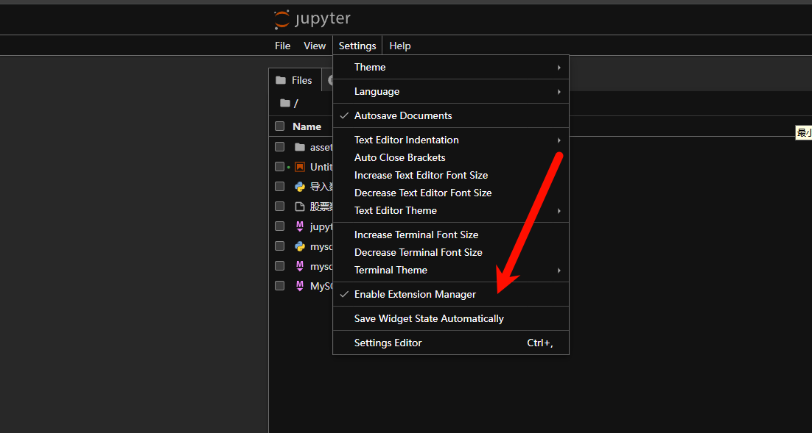

再点击这个

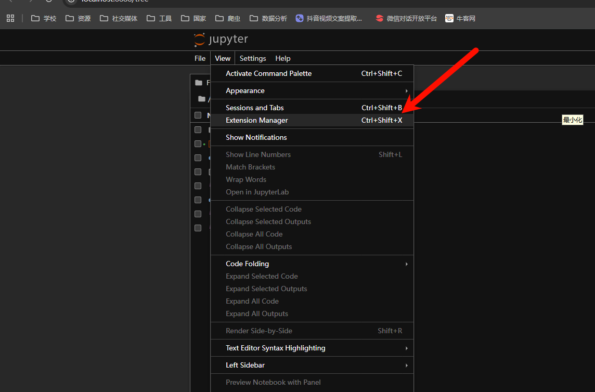

在这里就可以看到自己想要的插件和自己已经安装的插件了

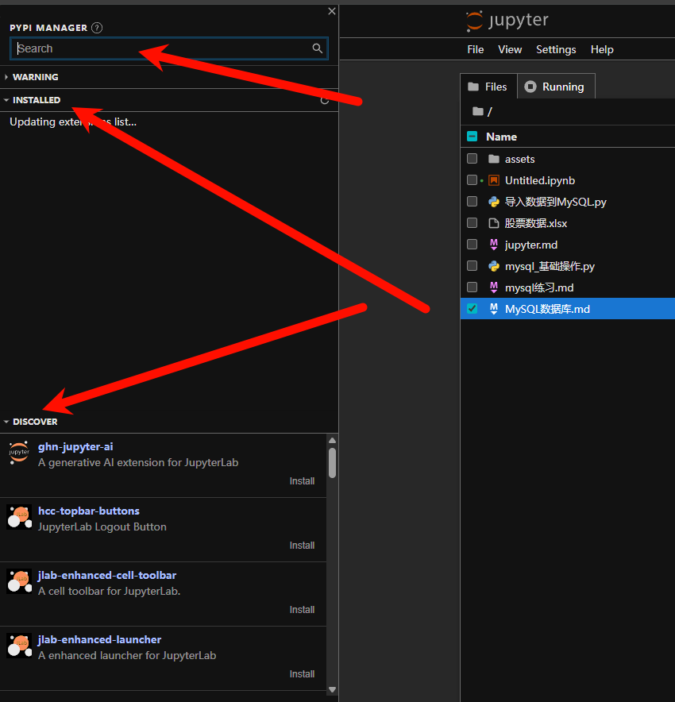

## IPython输入输出历史

- 可使用In/Out调用输入输出历史

- In返回一个字符串列表，里面是所有输入命令的字符串

- Out返回一个含有输出的命令的序号及其输出组成的字典

- 两者皆可以通过索引获取元素

当天运行的时候，变量和函数都会保存在这里，所以下面再输入相应的变量和函数的时候就不用再导入了。

第二天运行的时候如果要用之前的变量，就要点击这个restart运行一遍就有之前的环境了。

因为restart是从上往下运行的，所以写代码的时候要从上往下写，顺序一定不能错了

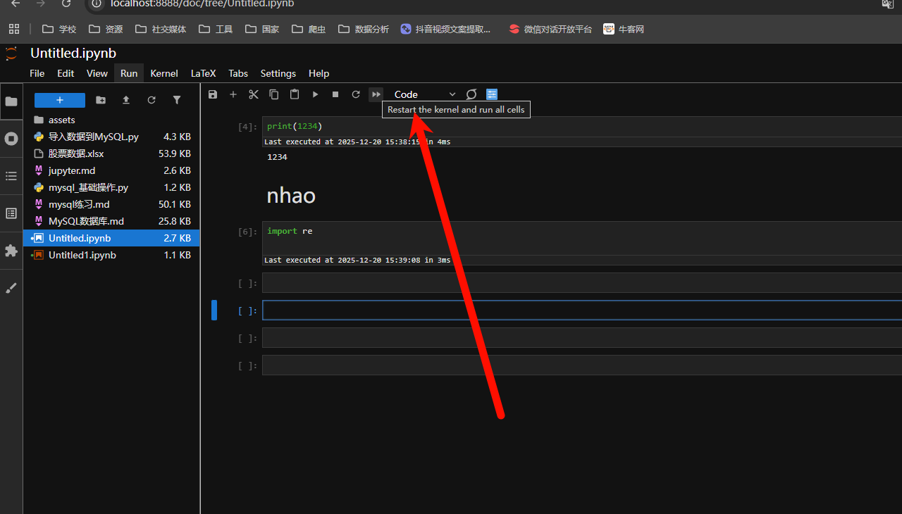

什么时候直接输入a+1的这种情况？

1. 单个代码块只运行一行内容的时候，不写print会加快效率

2. numpy pandas matplotlib。。。/矩阵/表格/业务场景展示的内容

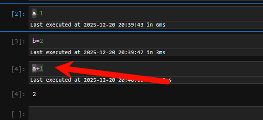

printf输出和直接输出的区别：

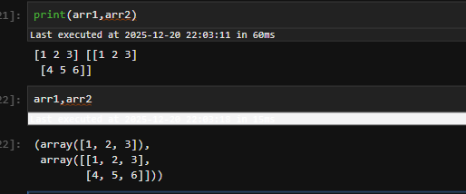

打印最好用`display(arr1,arr2)`这个函数。
