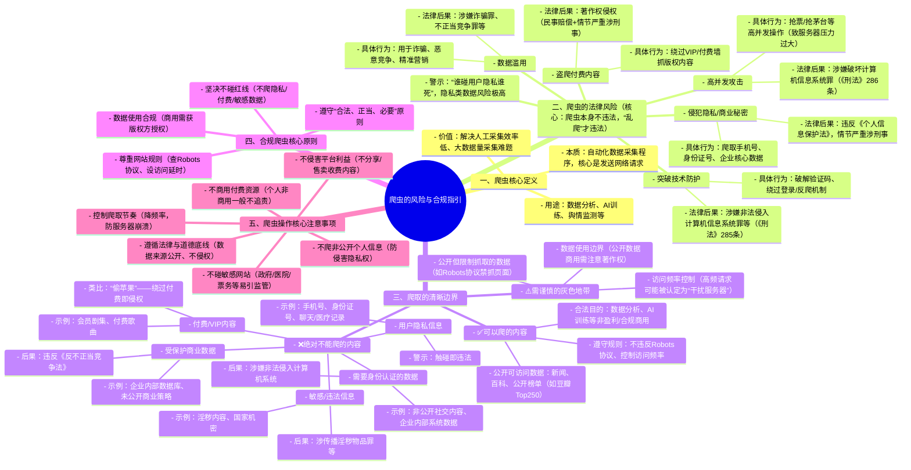

### 一、爬虫的核心定义

爬虫是**自动化数据采集程序**，能替代人工从网页、App 等数据源批量抓取信息并保存到本地，用于数据分析、AI 训练、舆情监测等场景。视频中强调，爬虫的本质是**发送网络请求**，核心价值在于解决人工采集效率低、数据量大时难以完成的问题。

---

### 二、爬虫的法律风险（视频核心观点 + 法律依据）

视频明确指出：**爬虫本身不违法，违法的是 “乱爬” 行为**。以下是常见法律风险：

|风险类型|具体行为|法律后果|
|---|---|---|
|**突破技术防护**|破解验证码、绕过登录认证、反爬机制（如 IP 封禁、频率限制）|涉嫌**非法侵入计算机信息系统罪**（《刑法》第 285 条）、**非法获取计算机信息系统数据罪**|
|**高并发攻击**|用于抢票、抢茅台等，对服务器造成巨大压力|涉嫌**破坏计算机信息系统罪**（《刑法》第 286 条），导致系统瘫痪时后果更严重中央网络安全和信息化委员会办公室 中华人民共和国国家互联网信息办公室|
|**侵犯隐私 / 商业秘密**|爬取手机号、身份证号、住址、企业核心数据|违反《个人信息保护法》《网络安全法》，情节严重构成**侵犯公民个人信息罪**或**侵犯商业秘密罪**|
|**盗爬付费内容**|绕过 VIP / 付费墙抓取版权内容|构成**著作权侵权**，面临民事赔偿，情节严重可能涉及刑事犯罪|
|**数据滥用**|将爬取数据用于诈骗、恶意竞争、精准营销|可能触犯《刑法》相关罪名，如诈骗罪、不正当竞争罪等|

视频特别警示：**“谁碰用户隐私谁死”**，强调用户隐私（电话、姓名、住址、身份证号等）绝对不能碰，此类行为风险极高。

---

### 三、能爬与不能爬的清晰边界（视频明确指引）

#### 1. ✅ 可以爬的内容

- **公开可访问的数据**：如新闻、百科、公开榜单（豆瓣 Top250）等，任何人无需权限即可查看、复制的信息
- **用于合法目的**：数据分析、AI 训练、舆情监测等非盈利或合规商业用途
- **遵守网站规则**：不违反 Robots 协议，控制访问频率，不干扰服务器正常运行

#### 2. ❌ 绝对不能爬的内容

|禁止类型|具体示例|视频类比|
|---|---|---|
|**付费 / VIP 内容**|视频平台会员剧集、音乐平台付费歌曲|相当于 “偷苹果”—— 商家明码标价售卖，绕过付费获取即侵权|
|**用户隐私信息**|手机号、身份证号、住址、聊天记录、医疗记录|触碰即违法，风险极高，“谁碰谁死”|
|**受保护的商业数据**|企业内部数据库、交易记录、客户名单、未公开的商业策略|违反《反不正当竞争法》，构成商业秘密侵权|
|**敏感 / 违法信息**|淫秽内容、国家机密、煽动性信息|可能涉及传播淫秽物品罪、泄露国家秘密罪等中华人民共和国最高人民检察院|
|**需要身份认证的数据**|非公开的社交账号内容、企业内部系统数据|未经授权访问涉嫌非法侵入计算机信息系统|

#### 3. ⚠️ 需谨慎的灰色地带

- **公开但限制抓取的数据**：如部分网站通过 Robots 协议禁止爬虫抓取特定页面
- **数据使用边界**：即使是公开数据，用于商业用途时需注意是否侵犯著作权或不正当竞争
- **访问频率控制**：高频请求可能被认定为 “干扰服务器正常功能”，触发法律风险

---

### 四、合规爬虫的核心原则（视频建议 + 法律指引）

1. **遵守 “合法、正当、必要” 原则**：仅抓取公开数据，用于明确合法目的，不超额抓取中国长安网
2. **尊重网站规则**：查看 Robots 协议，控制访问频率（如设置延时），避免给服务器造成压力
3. **不碰红线**：坚决不爬隐私、付费、敏感数据，不突破技术防护
4. **数据使用合规**：爬取数据后不得滥用，如需商用应获得版权方授权

视频总结：爬虫是工具，本身无善恶，**关键在于使用方式**。合规使用可助力数据分析、AI 发展，违规使用则可能引火烧身，甚至承担刑事责任。

根据视频内容，爬虫操作需要注意以下核心事项：

1. **不商用付费资源**
    
    爬取付费资源后，若提供给客户用于售卖，会涉及违法；此外，制作抢门票等脚本供大规模人群使用，也会触发风险，仅个人非商用使用一般不会被追责。
2. **不碰特定敏感网站**
    
    政府网站、医院、银行等民生领域相关网站（如火车票、故宫门票相关平台）尽量不要爬取，这类网站不仅大多配备反爬机制，且系统较为脆弱，爬取行为容易引发监管关注。
3. **控制爬取节奏，不损害目标网站权益**
    
    爬取时要降低请求频率，避免高并发爬取导致目标网站崩溃，否则可能面临报警追责；同时，严禁爬取数据后公开售卖，避免侵害目标网站的商业利益（如爬取电商平台数据售卖）。
4. **核心原则**
    
    爬虫的违法风险主要集中在三个方面：爬取了不该爬的数据、侵犯了国家或商业利益、影响了目标网站的正常运营并造成经济损失。

1. **禁止爬取非公开的个人信息**
    
    不要抓取手机号、身份证号等敏感个人数据，这类行为会直接侵害公民的隐私权。
2. **不得侵害目标平台的利益**
    
    严禁爬取平台的收费内容（如付费电影、电视剧、学术期刊论文等），并将其免费分享或制作成相关应用供他人使用。
3. **严格控制爬虫的请求频率**
    
    避免短时间内发送大量请求，防止造成目标网站服务器负载过重甚至瘫痪，同时也能避免消耗服务器高额流量配额，这类行为有可能被认定为非法攻击。

此外，使用爬虫技术时，还需要**遵循法律和道德底线**，确保数据来源公开且不侵犯版权。

# 爬虫合规操作检查清单

本清单基于视频核心内容及合规原则制定，涵盖**前期准备、数据禁区、技术操作、数据使用**四大核心环节，可直接用于爬虫项目自查。

## 一、 前期准备合规检查（必做项）

|检查项目|操作要求|完成情况（√/×）|
|---|---|---|
|查看 Robots 协议|1. 在目标网站域名后拼接 `/robots.txt`（例：豆瓣 `https://douban.com/robots.txt`）  2. 解读核心指令：  - `User-agent: *` 代表所有爬虫  - `Disallow: /xxx` 代表禁止抓取`/xxx`路径下的内容  - `Allow: /xxx` 代表允许抓取`/xxx`路径下的内容  3. 严格遵守协议中禁止抓取的目录||
|阅读网站使用条款|查看目标网站的 “用户协议”“隐私政策”，确认是否明确禁止爬虫抓取||

## 二、 数据抓取禁区检查（绝对不能碰）

|禁止抓取类型|具体示例|违规后果|自查结果（无此类行为√）|
|---|---|---|---|
|付费 / VIP 专属内容|视频平台会员剧集、音乐平台付费歌曲、文档网站付费下载资源|著作权侵权，民事赔偿 / 刑事风险||
|用户隐私信息|手机号、身份证号、住址、社交账号私信、医疗记录、金融账户信息|触犯《个人信息保护法》，涉嫌侵犯公民个人信息罪||
|受保护商业数据|企业内部数据库、未公开交易记录、客户名单、商业策略文档|构成不正当竞争 / 侵犯商业秘密罪||
|敏感 / 违法信息|国家机密、淫秽内容、煽动性违法信息|涉嫌危害国家安全 / 传播淫秽物品等刑事犯罪||
|需身份授权的非公开数据|未公开的社交账号内容、企业内网数据、政府内部系统数据|涉嫌非法侵入计算机信息系统罪||

## 三、 技术操作合规检查（规避法律风险）

|检查维度|合规操作建议|完成情况（√/×）|
|---|---|---|
|访问频率控制|1. 单 IP 请求间隔：小网站≥5 秒 / 次，大网站≥1-2 秒 / 次  2. 避免高并发请求，禁止用爬虫抢票、抢商品（会对服务器造成压力）  3. 可使用代理 IP 池，但需选择合规代理服务商||
|技术手段限制|1. 不破解网站反爬机制（如验证码、IP 封禁、登录验证）  2. 不伪造请求头（User-Agent）、不恶意绕开网站安全措施||
|爬虫标识规范|自定义`User-Agent`，注明爬虫名称、用途及开发者联系方式（便于网站方沟通）||

## 四、 数据使用合规检查（后续使用要求）

|检查项目|合规要求|完成情况（√/×）|
|---|---|---|
|数据用途|仅限**合法场景**：数据分析、AI 模型训练、舆情监测等，禁止用于诈骗、恶意营销||
|商用授权|若将爬取数据用于商业用途（如数据售卖、产品开发），需提前获得版权方 / 网站方授权||
|数据存储与销毁|1. 不存储隐私数据，若意外获取需立即删除  2. 定期清理过期数据，避免数据泄露风险||

## 最终自查结论

□ 完全合规，可启动爬虫项目

□ 存在部分风险项，需整改后再启动

□ 涉及禁区内容，建议终止项目

![[exported_image.png]]

# 爬虫风险与合规要点速查表

### 一、爬虫核心定义

- 本质：自动化数据采集程序（核心是发送网络请求）
- 用途：数据分析、AI 训练、舆情监测等
- 价值：解决人工采集效率低、大数据量采集难题

### 二、法律风险（爬虫本身不违法，“乱爬” 才违法）

|风险类型|具体行为|法律后果|
|---|---|---|
|突破技术防护|破解验证码、绕反爬机制|涉《刑法》285 条（非法侵入计算机系统罪）|
|高并发攻击|抢票 / 抢茅台等高并发操作|涉《刑法》286 条（破坏计算机信息系统罪）|
|侵隐私 / 商业秘密|爬手机号、企业核心数据|违《个人信息保护法》，情节严重涉刑|
|盗爬付费内容|绕 VIP 抓版权内容|著作权侵权（民事赔偿 + 情节严重涉刑）|
|数据滥用|用于诈骗、恶意竞争|涉诈骗罪、不正当竞争罪等|

- 警示：**“碰用户隐私必担责”**，隐私类数据风险极高

### 三、爬取边界

✅ **可爬内容**

- 公开可访问数据（新闻、百科、公开榜单如豆瓣 Top250）
- 合法目的（数据分析、AI 训练等非盈利 / 合规商用）
- 遵守网站规则（不违 Robots 协议、控制访问频率）

❌ **禁爬内容**

- 付费 / VIP 内容（会员剧集、付费歌曲）→ 侵权
- 用户隐私（手机号、身份证号）→ 直接违法
- 受保商密（企业内部数据库）→ 违《反不正当竞争法》
- 敏感 / 违法信息（淫秽、国家机密）→ 涉刑
- 需身份认证数据（非公开社交内容）→ 涉非法侵入系统

⚠️ **灰色地带**

- 公开但 Robots 协议禁抓的数据
- 公开数据商用（需注意著作权）
- 高频请求（易被认定为 “干扰服务器”）

### 四、合规原则

1. 遵守 “合法、正当、必要” 原则
2. 查看 Robots 协议 + 设置访问延时
3. 不碰隐私 / 付费 / 敏感数据红线
4. 商用数据需获版权方授权

### 五、操作注意事项

1. 不商用付费资源（个人非商用一般免责）
2. 不爬敏感网站（政府 / 医院 / 票务平台）
3. 降低爬取频率（避免服务器崩溃）
4. 不碰非公开个人信息
5. 不侵害平台利益（不分享 / 售卖收费内容）
6. 遵循法律 + 道德底线（数据来源公开、不侵权）

#爬虫 #不正当竞争 #敏感网站 #政府网站 #个人信息 #商业利益 #业务的基本盘 #robts协议 #爬取付费内容 #破解验证码 #商用数据  #高频请求 #爬取公开网站 #爬虫在中国的法律风险 